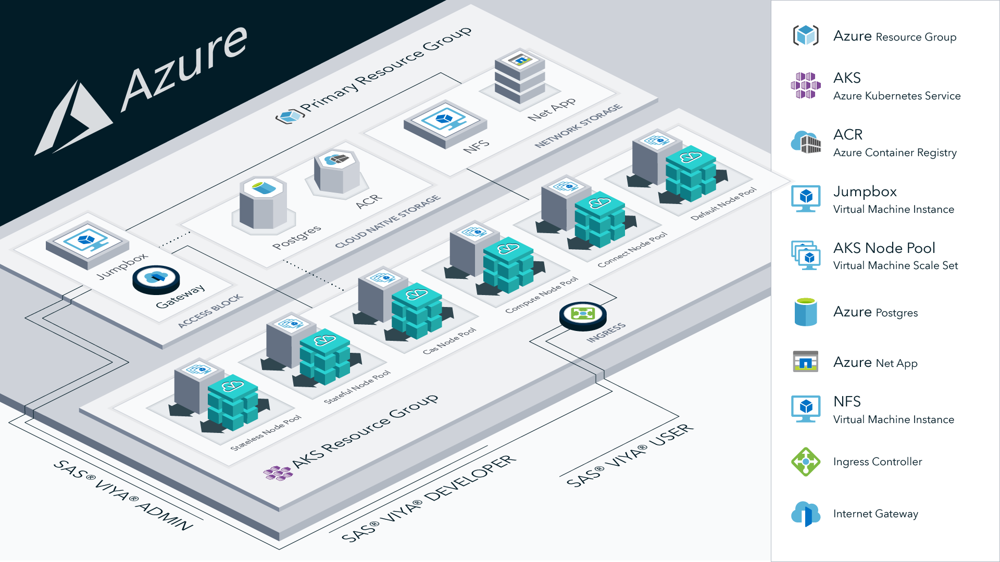

# SAS Viya 4 IaC for Azure

## Overview

This project contains Terraform scripts to provision Microsoft Azure Cloud infrastructure resources required to deploy SAS Viya 4 products. Here is a list of resources this project can create -

  >- Azure Resource Group
  >- Virtual Network, Network Security Groups and Network Security Rules
  >- Managed Azure Kubernetes Service (AKS) cluster
  >- System and User AKS Node pools with required Labels and Taints
  >- Infrastructure to deploy SAS Viya CAS in SMP or MPP mode
  >- Storage options for SAS Viya -  AzureDisk/Files(dev) or NFS Server or Azure NetApp Files(HA)
  >- Azure DB for PostgreSQL, optional
  >- Azure Container Registry, optional

[](./docs/images/viya4-iac-azure-diag.png?raw=true)

## Prerequisites

Operational knowledge of:

- [Terraform](https://www.terraform.io/intro/index.html)
- [Docker](https://www.docker.com/)
- [Microsoft Azure Cloud](https://azure.microsoft.com/)
- [Kubernetes](https://kubernetes.io/docs/concepts/)
 
This tool supports running both from terraform installed on your local machine or via a docker container. The Dockerfile for the container can be found [here](Dockerfile)

#### Terraform

- [Terraform](https://www.terraform.io/downloads.html) - v0.13.5
- Access to an **Azure Subscription** and **Service Principal** with '*Contributor*' role

#### Docker

- [Docker](https://docs.docker.com/get-docker/)
- Access to an **Azure Subscription** and **Service Principal** with '*Contributor*' role

## Getting Started

Run these commands in a Terminal session

### Clone this project

```bash
# clone this repo
git clone https://github.com/sassoftware/viya4-iac-azure

# move to directory
cd viya4-iac-azure
```

### Authenticating Terraform to access Azure

#### Terraform

Export these environment variables values, see [Authenticating using Service Principal and Secret](./docs/user/TerraformAzureAuthentication.md) for details

```bash
# export needed IDs and Secrets
export TF_VAR_subscription_id="SUBSCRIPTION_ID"
export TF_VAR_tenant_id="TENANT_ID"
export TF_VAR_client_id="SP_APPID"
export TF_VAR_client_secret="SP_PASSWD"
```
Save this to a file you can source and use later, like `$HOME/.azure_creds.sh`

#### Docker

Create a file with these environment variables values, see [Authenticating using Service Principal and Secret](./docs/user/TerraformAzureAuthentication.md) for details

```
# export needed IDs and Secrets
TF_VAR_subscription_id=[SUBSCRIPTION_ID]
TF_VAR_tenant_id=[TENANT_ID]
TF_VAR_client_id=[SP_APPID]
TF_VAR_client_secret=[SP_PASSWD]
```
Save this to a file you can use later, like `$HOME/.azure_docker_creds.env`

#### Building the docker image

Run the following command to create your `viya4-iac-azure` local docker image

```bash
docker build -t viya4-iac-azure .
```

### Customize Input Values

Create a file named `terraform.tfvars` to customize any input variable value. For starters, you can copy one of the provided example variable definition files in `./examples` folder. For more details on the variables declared in [variables.tf](variables.tf) refer to [CONFIG-VARS.md](docs/CONFIG-VARS.md).

When using a variable definition file other than `terraform.tfvars`, see [Advanced Terraform Usage](docs/user/AdvancedTerraformUsage.md) for additional command options.

### Running

#### Terrafrom

Source your credentials into your shells enviornment

```bash
. $HOME/.azure_creds.sh
```

Initialize the Terraform environment for this project by running

```bash
terraform init
```

This creates a `.terraform` directory locally that contains Terraform plugins/modules used in this project.

**Note:** `terraform init` only needs to be run once unless new Terraform plugins/modules were added.

To preview the resources that the Terraform script will create, optionally run

```bash
terraform plan
```

When satisfied with the plan and ready to create cloud resources, run

```bash
terraform apply
```

`terraform apply` can take a few minutes to complete. Once complete, output values are written to the console. These output values can be displayed anytime by again running

```bash
terraform output
```
#### Docker

To preview the resources that the Terraform script will create, optionally run

```
docker run --rm \        
  --env-file $HOME/~/.azure_docker_creds.env \
  -v $(pwd):/workspace viya4-iac-azure \
  plan -var-file /workspace/sas-sample-input.tfvars -state /workspace/terraform.tfstate
```

When satisfied with the plan and ready to create cloud resources, run

```bash
docker run --rm \        
  --env-file $HOME/~/.azure_docker_creds.env \
  -v $(pwd):/workspace viya4-iac-azure \
  apply -var-file /workspace/sas-sample-input.tfvars -auto-approve -state /workspace/terraform.tfstate
```
`terraform apply` can take a few minutes to complete. Once complete, output values are written to the console.

The output values can be displayed anytime by again running

```bash
docker run --rm \        
  --env-file $HOME/~/.azure_docker_creds.env \
  -v $(pwd):/workspace viya4-iac-azure \
  output -state /workspace/terraform.tfstate
```

### Modifying Cloud Resources

After provisioning the infrastructure if changes were to be made to inputs e.g., change number of nodes in a node pool or set create_postgres to true/false, then add the variable to terraform.tfvars and changes the value and run either `terraform apply` or the equivalent `docker run ... apply` command.

### Interacting with Kubernetes cluster

#### Terraform 
Terraform script writes `kube_config` output value to a file `./[prefix]-aks-kubeconfig.conf`. Now that you have your Kubernetes cluster up and running, here's how to connect to the cluster

```bash
export KUBECONFIG=./[prefix]-aks-kubeconfig.conf
kubectl get nodes
```
#### Docker

```bash
docker run --rm \        
  --env-file $HOME/~/.azure_docker_creds.env \
  -v $(pwd):/workspace viya4-iac-azure \
  output kube-config -state /workspace/terraform.tfstate > ./[prefix]-aks-kubeconfig.conf
  export KUBECONFIG=./[prefix]-aks-kubeconfig.conf
  kubectl get nodes
```
### Examples

We include several samples - `sample-input*.tfvars` in this repo to get started. Evaluate the sample files, then review the [CONFIG-VARS.md](docs/CONFIG-VARS.md) to see what other variables can be used.

### Troubleshooting

See [troubleshooting](./docs/Troubleshooting.md) page.

## Contributing

> We welcome your contributions! Please read [CONTRIBUTING.md](CONTRIBUTING.md) for details on how to submit contributions to this project.

## License

> This project is licensed under the [Apache 2.0 License](LICENSE).

## Additional Resources

### Azure resources

- [Azure CLI](https://docs.microsoft.com/en-gb/cli/azure/?view=azure-cli-latest)
- [Terraform on Azure](https://docs.microsoft.com/en-us/azure/terraform)
- [Configure Terraform access to Azure](https://docs.microsoft.com/en-us/azure/terraform/terraform-install-configure)
- [AKS intro](https://docs.microsoft.com/en-us/azure/aks/intro-kubernetes)
- [Service Principal for AKS](https://docs.microsoft.com/en-us/azure/aks/kubernetes-service-principal)
- [Create AKS using Terraform](https://docs.microsoft.com/en-us/azure/terraform/terraform-create-k8s-cluster-with-tf-and-aks)
- [Azure Active Directory(AD) & Service Principal(SP) concepts](https://docs.microsoft.com/en-us/azure/active-directory/develop/app-objects-and-service-principals)

### Terraform resources

- [Azure Provider](https://www.terraform.io/docs/providers/azurerm/index.html)
- [Azure AKS](https://www.terraform.io/docs/providers/azurerm/r/kubernetes_cluster.html)
