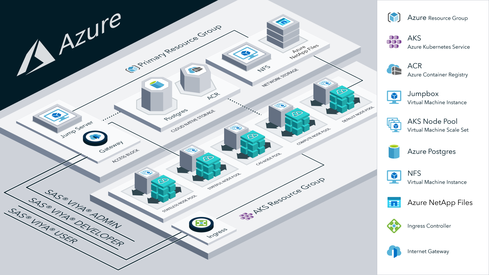

# SAS Viya 4 Infrastructure as Code (IaC) for Microsoft Azure

## Overview

This project contains Terraform scripts to provision the Microsoft Azure Cloud infrastructure resources that are required to deploy SAS Viya 4 product offerings. Here is a list of resources that this project can create:

  >- Azure resource group(s): primary resource group and AKS resource group
  >- Virtual network, network security groups, and network security rules
  >- Managed Azure Kubernetes Service (AKS) cluster
  >- System and User AKS Node pools with required Labels and Taints
  >- Infrastructure to deploy SAS Viya CAS in SMP or MPP mode
  >- Storage options for SAS Viya -  NFS Server (Standard) or Azure NetApp Files (HA)
  >- Azure DB for PostgreSQL, optional
  >- Azure Container Registry, optional

[](./docs/images/viya4-iac-azure-diag.png?raw=true)

This project helps you to automate the cluster-provisioning phase of SAS Viya deployment. To learn about all phases and options of the
SAS Viya deployment process, see [Getting Started with SAS Viya and Azure Kubernetes Service](https://go.documentation.sas.com/doc/en/itopscdc/v_015/itopscon/n1d7qc4nfr3s5zn103a1qy0kj4l1.htm) in _SAS Viya Operations_.

Once the cloud resources are provisioned, use the [viya4-deployment](https://github.com/sassoftware/viya4-deployment) project to deploy 
SAS Viya 4 in your cloud environment. For more information about SAS Viya 4 requirements and documentation for the deployment
process, refer to the [SAS&reg; Viya&reg; 4 IT Operations Guide](https://go.documentation.sas.com/doc/en/itopscdc/default/itopswlcm/home.htm).

## Prerequisites

Use of these tools requires operational knowledge of the following technologies:

- [Terraform](https://www.terraform.io/intro/index.html)
- [Docker](https://www.docker.com/)
- [Microsoft Azure Cloud](https://azure.microsoft.com/)
- [Kubernetes](https://kubernetes.io/docs/concepts/)
 

### Technical Prerequisites

This project supports two options for running Terraform scripts:
- Terraform installed on your local machine
- Using a Docker container to run Terraform
  
  For more information, see [Docker Usage](./docs/user/DockerUsage.md). Using Docker to run the Terraform scripts is recommended.

Access to an **Azure Subscription** and an [**Identity**](./docs/user/TerraformAzureAuthentication.md) with the *Contributor* role are required.

#### Terraform Requirements:
- [Terraform](https://www.terraform.io/downloads.html) - v1.0.0
- [kubectl](https://kubernetes.io/docs/tasks/tools/install-kubectl) - v1.19.9
- [jq](https://stedolan.github.io/jq/) - v1.6
- [Azure CLI](https://docs.microsoft.com/en-us/cli/azure) - (optional - useful as an alternative to the Azure Portal) - v2.24.2

#### Docker Requirements:
- [Docker](https://docs.docker.com/get-docker/)

## Getting Started

When you have prepared your environment with the prerequisites, you are ready to obtain and customize the Terraform scripts that
will set up your Kubernetes cluster.

### Clone this Project

Run the following commands from a terminal session:

```bash
# clone this repo
git clone https://github.com/sassoftware/viya4-iac-azure

# move to the project directory
cd viya4-iac-azure
```

### Authenticating Terraform to Access Microsoft Azure

The Terraform process manages Microsoft Azure resources on your behalf. In order to do so, it needs your Azure account information and a user
identity with the required permissions. See [Terraform Azure Authentication](./docs/user/TerraformAzureAuthentication.md) for details.

### Customizing Input Values

Terraform scripts require variable definitions as input. Review and modify default values to meet your requirements. Create a file named
`terraform.tfvars` to customize any input variable value documented in the [CONFIG-VARS.md](docs/CONFIG-VARS.md) file. 

To get started, you can copy one of the example variable definition files provided in the `./examples` folder. For more information about the
variables that are declared in each file, refer to the [CONFIG-VARS.md](docs/CONFIG-VARS.md) file.

You have the option to specify variable definitions that are not included in `terraform.tfvars` or to use a variable definition file other than
`terraform.tfvars`. See [Advanced Terraform Usage](docs/user/AdvancedTerraformUsage.md) for more information.

## Creating and Managing the Cloud Resources

Create and manage the required cloud resources. Perform one of the following steps, based on whether you are using Docker: 

- run [Terraform](docs/user/TerraformUsage.md) directly on your workstation
- run the [Docker container](docs/user/DockerUsage.md) (recommended)

### Troubleshooting

See the [Troubleshooting](./docs/Troubleshooting.md) page for information about possible issues that you might encounter.

## Contributing

> We welcome your contributions! See [CONTRIBUTING.md](CONTRIBUTING.md) for information about how to submit contributions to this project.

## License

> This project is licensed under the [Apache 2.0 License](LICENSE).

## Additional Resources

### Azure Resources

- [Azure CLI](https://docs.microsoft.com/en-gb/cli/azure/?view=azure-cli-latest)
- [Terraform on Azure](https://docs.microsoft.com/en-us/azure/terraform)
- [Configure Terraform access to Azure](https://docs.microsoft.com/en-us/azure/terraform/terraform-install-configure)
- [AKS intro](https://docs.microsoft.com/en-us/azure/aks/intro-kubernetes)
- [Service Principal for AKS](https://docs.microsoft.com/en-us/azure/aks/kubernetes-service-principal)
- [Create AKS using Terraform](https://docs.microsoft.com/en-us/azure/terraform/terraform-create-k8s-cluster-with-tf-and-aks)
- [Azure Active Directory(AD) & Service Principal(SP) concepts](https://docs.microsoft.com/en-us/azure/active-directory/develop/app-objects-and-service-principals)

### Terraform Resources

- [Azure Provider](https://www.terraform.io/docs/providers/azurerm/index.html)
- [Azure AKS](https://www.terraform.io/docs/providers/azurerm/r/kubernetes_cluster.html)
